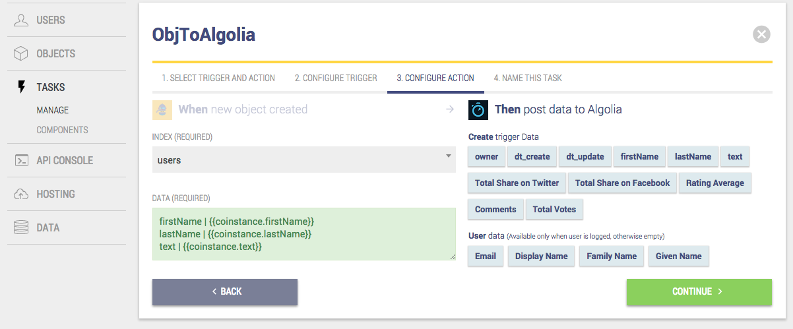

stamplay-tutorials - 04-algolia-firebase
========================================

## What you'll learn

## Using the example 

- Requirement : An account on Algolia and other to Firebase
- Create an application in the [Stamplay Editor](https://editor.stamplay.com)
- Define the entity for this app, we will define the `message` custom object as follows:
    * firstName: **string**, lastName: **string**, text : **string**
- Add Algolia and Firebase components
- Define two differents tasks:
	The first: On new Object then Algolia Push data, set the Object instance to `message` custom object then select the index of Algolia and compile the data section
	The second: On new Object then Firebase Push data, set the Object instance to `message` custom object then write the path of Firebase and compile the data section 
	
- Use the Stamplay hosting or your own hosting 

## The demo

You can find the complete demo [here](https://algoliafirebase.stamplayapp.com/)

### Stamplay hosting

In order to use the Stamplay hosting you need to: 
- Install the Stamplay [command line tool](https://stamplay.com/docs/hosting)
- Clone the repository
- [Deploy](https://stamplay.com/docs/hosting#deploying) this tutorial

### Your hosting

You can use your own hosting and just make API calls towards Stamplay endpoints.
You need to:
- Drop your files in your own server
- From the [Stamplay Editor](https://editor.stamplay.com), hosting section, add to the CORS settings your domain.